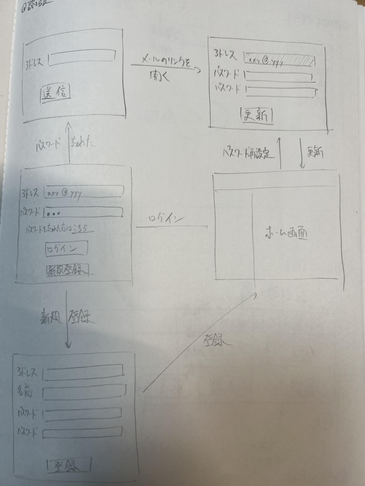
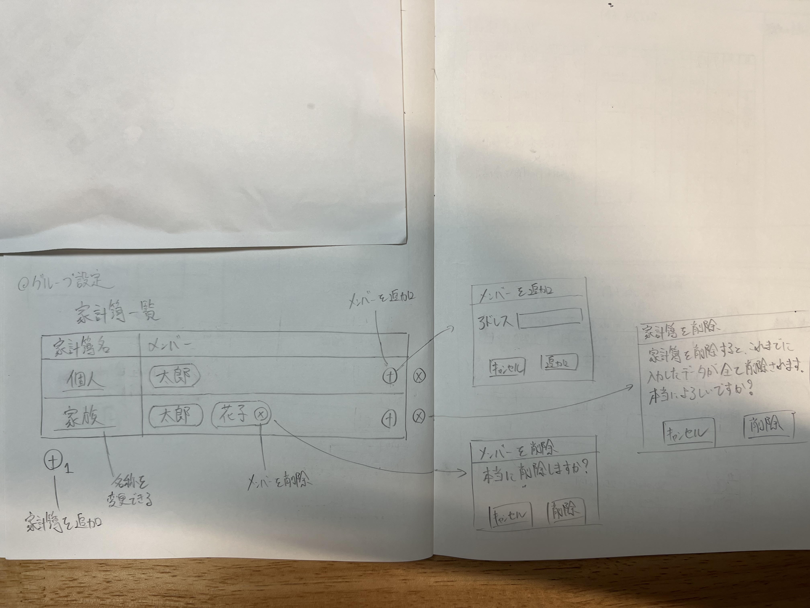
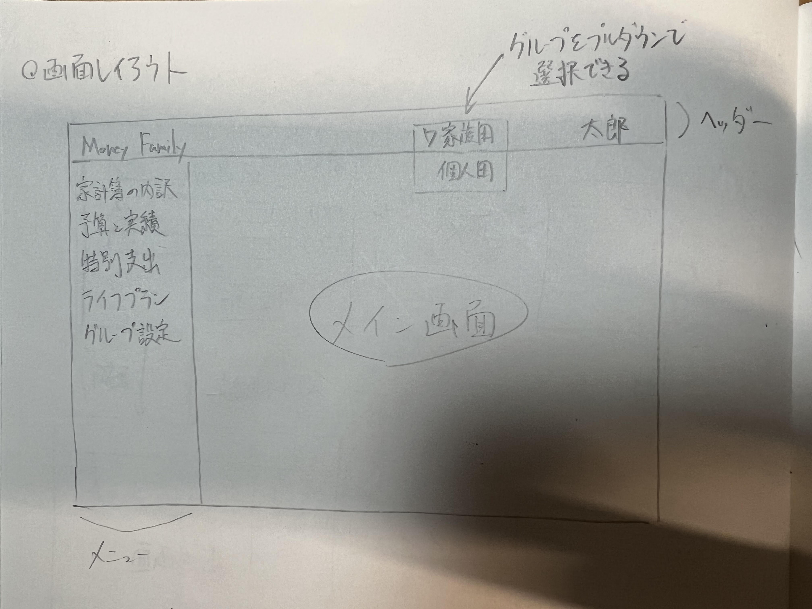
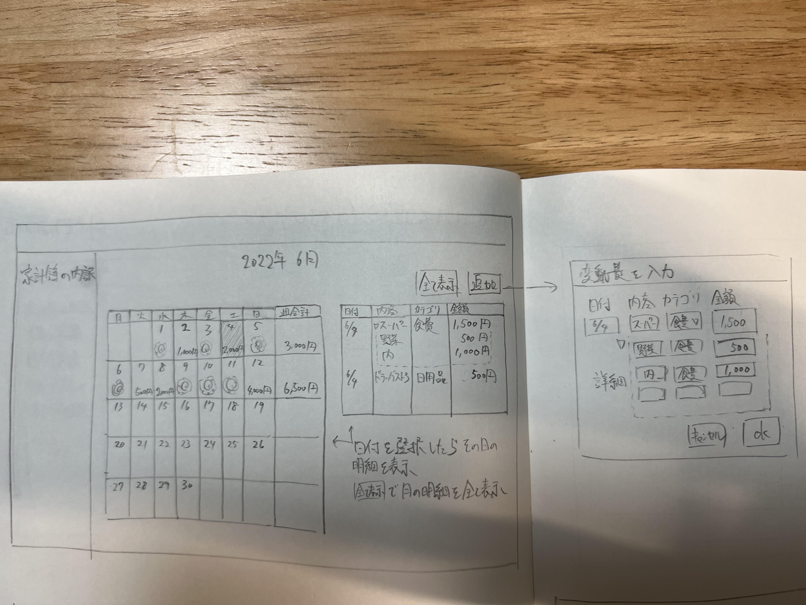
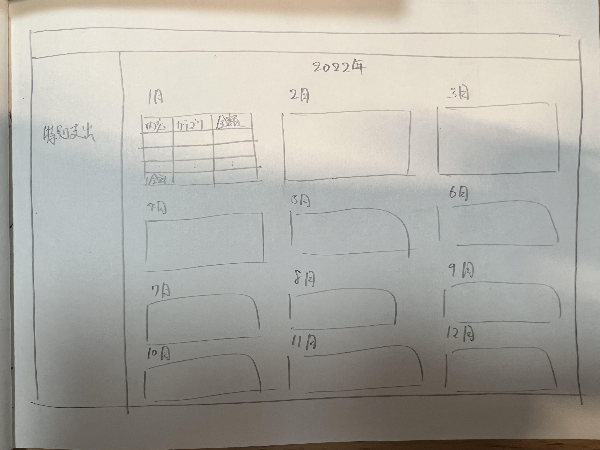
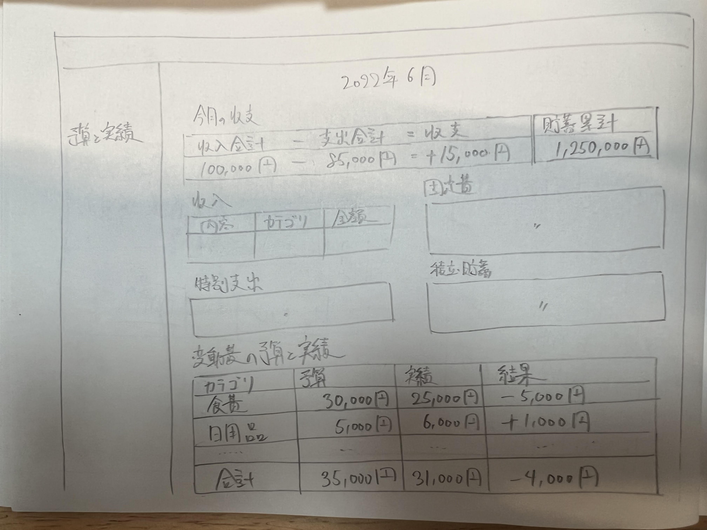

# 画面設計

## 概要
画面として以下の種類がある。
- ログインなどの認証画面
- 家計簿設定画面
- メニュー
  - 家計簿の内訳
  - 特別支出
  - 予算と実績

今回は手書きで画面設計を行い、実際にAngularで画面を作成しながら調整していくこととする。

## 各画面

### 認証関連

### 家計簿切り替え

### 各メニュー

#### 家計簿の内訳

#### 特別支出

#### 予算と実績
